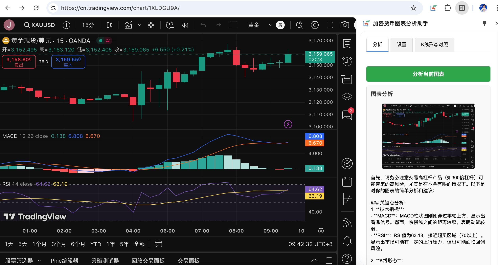
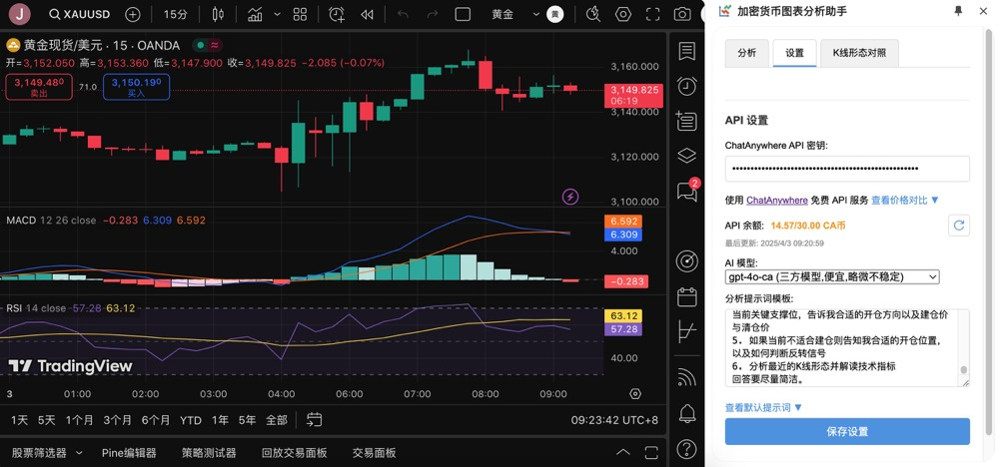

# 智能图表分析助手 (Smart Chart Analysis Assistant)

一个 Chrome 浏览器扩展，旨在帮助用户分析 OKX 和 TradingView 网站上的金融交易图表。它利用 AI (通过 ChatAnywhere API) 对图表截图进行分析，并提供一个包含常见 K 线形态及其解读的参考指南。

# 示例

## ✨ 功能特性

*   **AI 图表分析**: 对当前页面的图表进行截图，并发送给 AI 模型进行分析预测。
*   **支持的网站**:
    *   OKX (`okx.com`)
    *   TradingView (`tradingview.com`)
    *   Gate (`gate.com`)
    *   Binance (`binance.com`)
*   **K 线形态对照**: 内置常见 K 线形态的 SVG 图示和文字解读，方便快速参考。
*   **可配置设置**:
    *   用户可以输入自己的 ChatAnywhere API 密钥。
    *   支持选择不同的 AI 模型（包括支持图像分析的多模态模型）。
    *   允许自定义图表分析的提示词模板。
    *   显示 API 余额并支持刷新。
*   **简洁侧边栏界面**: 通过浏览器侧边栏提供所有功能，不干扰页面浏览。

## 🚀 安装

由于此扩展未在 Chrome 网上应用店发布，您需要手动加载：

1.  下载或克隆此项目代码到您的本地计算机。
2.  打开 Chrome 浏览器，在地址栏输入 `chrome://extensions` 并回车。
3.  在扩展程序页面的右上角，打开“**开发者模式**”(Developer mode)。
4.  点击左上角的“**加载已解压的扩展程序**”(Load unpacked) 按钮。
5.  在文件选择窗口中，选择您刚才下载或克隆的项目代码所在的**根目录** (包含 `manifest.json` 文件的那个目录)。
6.  扩展程序图标将出现在您的 Chrome 工具栏中。

## 💡 使用方法

1.  导航到支持的网站（OKX、TradingView、Gate 或 Binance）的图表页面。
2.  点击浏览器工具栏中的“智能图表分析助手”图标，打开侧边栏。
3.  **首次使用**:
    *   切换到“**设置**”标签页。
    *   输入您的 [ChatAnywhere API 密钥](https://github.com/chatanywhere/GPT_API_free)。如果您没有，可以按照页面上的链接指引申请。
    *   （可选）选择您偏好的 AI 模型。请确保选择支持图像分析的模型（如 `gpt-4o-ca`）以进行图表分析。
    *   （可选）修改分析提示词模板。
    *   点击“**保存设置**”。
    *   您可以通过点击刷新按钮查看 API 余额。
4.  切换回“**分析**”标签页。
5.  点击“**分析当前图表**”按钮。
6.  扩展将截取当前页面，并在下方显示截图和 AI 的分析结果。
7.  您可以随时切换到“**K线形态对照**”标签页查看常见的 K 线形态图示和解读。

## 🛠️ 技术栈

*   JavaScript (ES6 Modules)
*   HTML5
*   CSS3
*   Chrome Extension Manifest V3 APIs
*   [ChatAnywhere API](https://api.chatanywhere.tech/) (用于 AI 分析)
*   SVG (用于绘制 K 线形态图)
